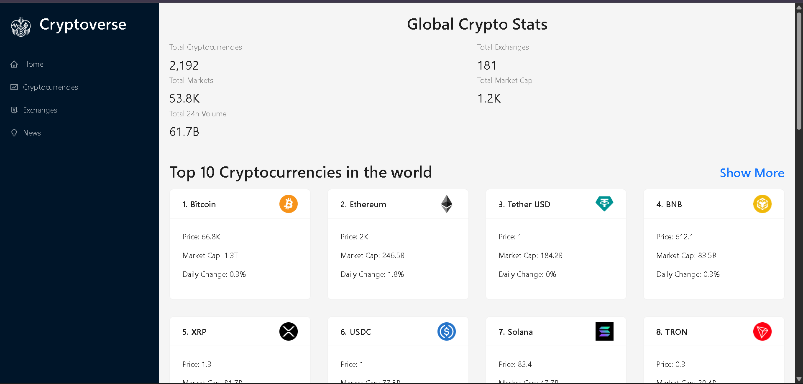
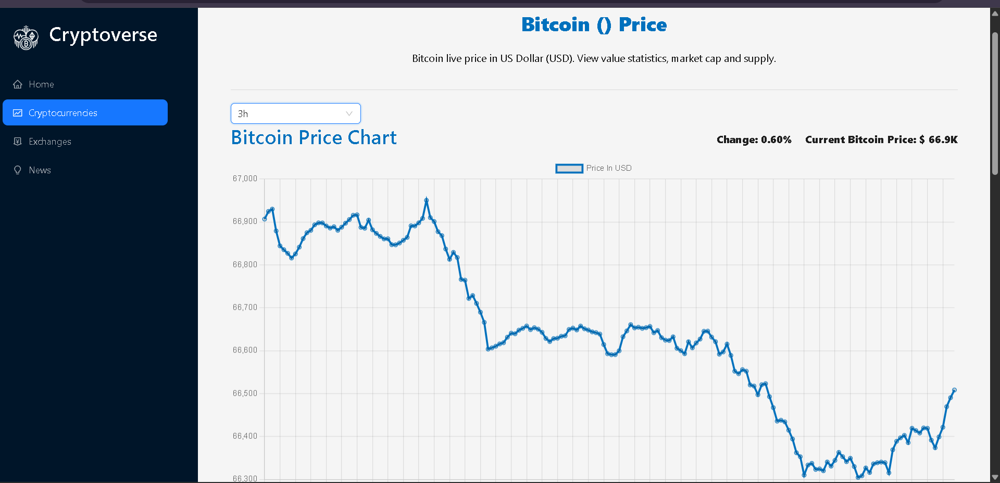

# CryptoVerse — Crypto Prices, Exchanges & News

A modern cryptocurrency dashboard that shows **global market stats**, **top cryptocurrencies**, **exchanges**, and the **latest crypto news** in one place. Browse coins, view price/market cap/daily change, and stay updated with real-time headlines.

---

## Demo

- **Live Demo:** https://crypto-app-19.vercel.app/
- **Screenshots:** 




---

## Features

- **Global Crypto Stats**
  - Total cryptocurrencies, exchanges, markets, market cap, and 24h volume
- **Top Cryptocurrencies**
  - View top coins with **price**, **market cap**, and **daily change**
  - “Show more” to browse additional coins
- **Exchanges**
  - Browse exchange listings (where supported by the API/UI)
- **Crypto News Feed**
  - Latest headlines with source + publish time
  - Categories + “Show more” to load more news
- **Charts**
  - Price/history visualizations using Chart.js
- **Responsive UI**
  - Works well on mobile, tablet, and desktop

---

## Tech Stack

- **React (Create React App)** — UI (`react`, `react-scripts`)
- **React Router DOM v7** — routing
- **Redux Toolkit + RTK Query** — state + API fetching/caching
- **Ant Design (antd)** — UI components + icons
- **Axios** — HTTP requests
- **Chart.js + react-chartjs-2** — charts/graphs
- **Moment.js** — date/time formatting
- **millify** — number formatting (market caps, volumes)
- **html-react-parser** — rendering HTML from news descriptions (when needed)

---

## Data Sources

This app uses **RapidAPI** for crypto data and news.

### News API (RapidAPI)

- Host: `cryptocurrency-news-api2.p.rapidapi.com`
- Endpoint pattern: `/sources/{newsCategory}?limit={pageSize}`

---

## Project Setup (Local)

### Prerequisites

- Git
- Node.js
- npm

### Installation

```bash
npm install

### Run the project

```bash
npm start

### Build for production
```bash
npm run build

### Project Structure
.
├── public/
│   ├── index.html
│   ├── favicon.ico
│   └── manifest.json
├── src/
│   ├── app/
│   │   └── store.js              # Redux store setup
│   ├── components/
│   │   ├── Homepage.jsx
│   │   ├── Cryptocurrencies.jsx
│   │   ├── CryptoDetails.jsx
│   │   ├── Exchanges.jsx
│   │   ├── News.jsx
│   │   ├── LineChart.jsx
│   │   ├── Navbar.jsx
│   │   ├── Loader.jsx
│   │   └── index.js
│   ├── services/
│   │   ├── cryptoApi.js          # coins/market data API (RTK Query)
│   │   └── cryptoNewsApi.js      # news API (RTK Query)
│   ├── images/
│   │   └── cryptocurrency.png
│   ├── App.js
│   ├── App.css
│   └── index.js
├── package.json
└── README.md

Credits
RapidAPI — crypto data + news APIs
Chart.js / react-chartjs-2 — charts
Ant Design — UI components


License
MIT License © chisapachikwa